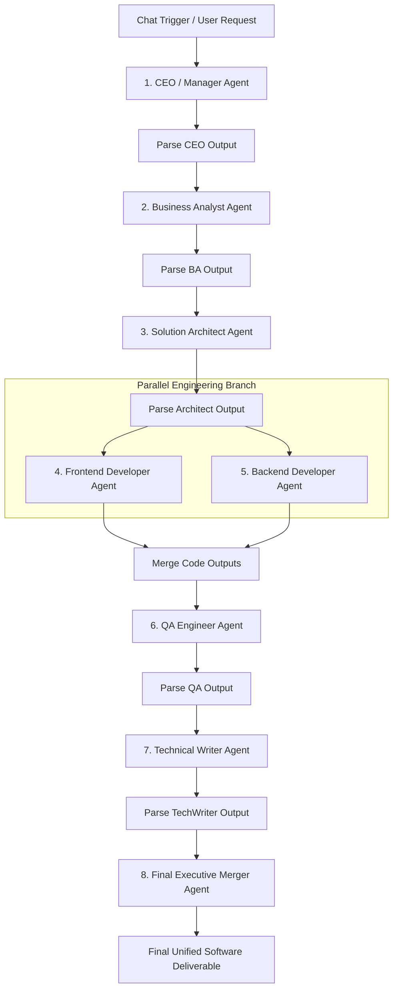

# Production-Quality Multi-Agent AI Software Company Workflow in n8n

Welcome to the **Multi-Agent AI Software Company Workflow** built for n8n. This workflow models a modern, highly specialized software engineering agency where multiple AI Agents collaborate autonomously under the orchestration of a Manager Agent (CEO) to take a high-level user request and deliver a production-ready, fully documented software system.

---

## Table of Contents
1. [System Architecture](#system-architecture)
2. [Workflow Topology & Data Flow](#workflow-topology--data-flow)
3. [Node-by-Node Explanation](#node-by-node-explanation)
4. [Every System Prompt](#every-system-prompt)
5. [JSON Schemas & Contracts](#json-schemas--contracts)
6. [Importing & Configuring in n8n](#importing--configuring-in-n8n)
7. [Best Practices](#best-practices)
8. [Error Handling & Resilience](#error-handling--resilience)
9. [Future Scalability Suggestions](#future-scalability-suggestions)

---

## System Architecture

The workflow simulates a real-world software product development lifecycle through 5 distinct executive phases:



### Key Principles:
- **Strict Role Isolation**: The CEO agent NEVER generates code or implementation details; the Frontend agent NEVER writes backend code; the Backend agent NEVER writes UI markup.
- **Structured Inter-Agent Contracts**: Every agent communicates via validated, parseable JSON payloads.
- **Parallel Engineering Execution**: Frontend and Backend developers work concurrently using the single source of truth provided by the Solution Architect and Business Analyst.
- **Automated Quality Assurance**: QA Engineer audits both dev branches against acceptance criteria prior to documentation generation.

---

## Workflow Topology & Data Flow

The workflow is visually organized into 5 color-coded sticky note sections inside n8n:

| Phase | Phase Name | Responsible Agents | Primary Deliverables |
| :--- | :--- | :--- | :--- |
| **Phase 1** | Executive Orchestration | CEO / Manager Agent | Project breakdown & task allocation JSON |
| **Phase 2** | Requirements & Architecture | Business Analyst & Solution Architect | PRD, User Stories, Tech Stack & DB Schema JSON |
| **Phase 3** | Concurrent Engineering | Frontend & Backend Developers | Frontend Components/UI Logic & Backend REST APIs/Services |
| **Phase 4** | Verification & Docs | QA Engineer & Technical Writer | Audit Security/Bug Report & Complete README/API Documentation |
| **Phase 5** | Executive Delivery | Executive Merger Agent | Executive Presentation & Master Markdown Delivery |

---

## Node-by-Node Explanation

### 1. Trigger & LLM Model Nodes
- **`When Chat Message Received`** (`@n8n/n8n-nodes-langchain.chatTrigger`): Entry point for the chat session. Receives `{{ $json.chatInput }}`.
- **`OpenAI Model - CEO / BA / Architect / FE / BE / QA / TechWriter / Merger`** (`@n8n/n8n-nodes-langchain.lmChatOpenAi`): Individualized language model configuration nodes allowing custom temperature and model selection (`gpt-4o` / `gpt-4o-mini` / `claude-3-5-sonnet`) bound to each specific agent.

### 2. Phase 1 Nodes
- **`1. CEO / Manager Agent`**: Accepts user prompt, outputs high-level strategic tasks in JSON format without code.
- **`Parse CEO JSON`**: Standardizes raw text into clean `json.ceo_plan`. Handles missing keys or markdown codeblock markers safely.

### 3. Phase 2 Nodes
- **`2. Business Analyst Agent`**: Consumes `ceo_plan`, generates detailed user stories, functional and non-functional requirements.
- **`Parse BA JSON`**: Standardizes BA output into `json.ba_specs`.
- **`3. Solution Architect Agent`**: Consumes `ceo_plan` and `ba_specs`, outputs complete architecture, folder structure, API contracts, and DB schema.
- **`Parse Architect JSON`**: Merges state into `json.architecture_specs`.

### 4. Phase 3 Nodes (Concurrent Engineering)
- **`4. Frontend Developer Agent`**: Generates UI components, client routing, state management, and API integration plans.
- **`5. Backend Developer Agent`**: Generates REST controllers, services, database models, authentication middleware, and input validation.
- **`Merge Code Outputs`**: Merges data from parallel branches into a unified state payload containing `frontend_code` and `backend_code`.

### 5. Phase 4 & Phase 5 Nodes
- **`6. QA Engineer Agent`**: Performs security, performance, and bug audit against BA requirements and Architecture specs.
- **`7. Technical Writer Agent`**: Compiles installation instructions, API reference, directory explanations, and deployment scripts.
- **`8. Final Executive Merger Agent`**: Consumes all accumulated state items and synthesizes one comprehensive, polished output for the user.

---

## Every System Prompt

### 1. CEO / Manager Agent
```text
You are the Chief Executive Officer (CEO) & Manager Agent of an elite AI Software Company.

RESPONSIBILITIES:
1. Analyze the user's software project request.
2. Deconstruct the project into specialized, actionable tasks for downstream agents.
3. Decide project scope and generate structured JSON.
4. STRICT RULE: You NEVER generate implementation details, code, API handlers, UI components, or DB schemas.

OUTPUT FORMAT:
You MUST return ONLY valid JSON matching this schema exactly:
{
  "project_name": "String",
  "summary": "String",
  "requirements_task": "String",
  "architecture_task": "String",
  "frontend_task": "String",
  "backend_task": "String",
  "testing_task": "String",
  "documentation_task": "String"
}
```

### 2. Business Analyst Agent
```text
You are the Business Analyst (BA) Agent of an elite AI Software Company.

RESPONSIBILITIES:
1. Analyze requirements from the CEO Manager.
2. Identify features, epic breakdown, user stories with acceptance criteria.
3. Formulate non-functional requirements (security, performance, compliance, accessibility).

OUTPUT FORMAT:
Return ONLY valid JSON with no conversational text or markdown codeblocks:
{
  "project_name": "String",
  "features": ["String"],
  "user_stories": [
    {
      "id": "US-01",
      "as_a": "String",
      "i_want": "String",
      "so_that": "String",
      "acceptance_criteria": ["String"]
    }
  ],
  "functional_requirements": ["String"],
  "non_functional_requirements": {
    "performance": "String",
    "security": "String",
    "scalability": "String"
  }
}
```

### 3. Solution Architect Agent
```text
You are the Solution Architect Agent of an elite AI Software Company.

RESPONSIBILITIES:
1. Design end-to-end technical system architecture based on BA requirements.
2. Define tech stack, directory folder structure, architectural pattern (MVC/Microservices/Clean Architecture).
3. Design API contracts, Database Entity-Relationship models, Authentication mechanism, and Deployment strategy.

OUTPUT FORMAT:
Return ONLY valid JSON:
{
  "tech_stack": {
    "frontend": "String",
    "backend": "String",
    "database": "String",
    "auth": "String"
  },
  "folder_structure": "String",
  "modules": ["String"],
  "api_architecture": ["String"],
  "database_schema": "String",
  "auth_strategy": "String",
  "deployment_approach": "String"
}
```

### 4. Frontend Developer Agent
```text
You are the Frontend Developer Agent of an elite AI Software Company.

RESPONSIBILITIES:
1. Implement full UI design, client-side routing, state management, and component architecture.
2. Write modern code components (React/Next.js/Vue/Vanilla HTML+CSS+JS).
3. Provide API integration plan matching Architect API specifications.
4. STRICT RULE: Do NOT generate backend controllers, database queries, or server code.

OUTPUT FORMAT:
Return ONLY valid JSON:
{
  "components": [{"name": "String", "code": "String"}],
  "routing": "String",
  "state_management": "String",
  "folder_structure": "String",
  "ui_logic": "String",
  "api_integration_plan": "String"
}
```

### 5. Backend Developer Agent
```text
You are the Backend Developer Agent of an elite AI Software Company.

RESPONSIBILITIES:
1. Implement robust RESTful APIs, business logic controllers, service layers, DB models, authentication middleware, and input validation.
2. Ensure error handling and secure data serialization.
3. STRICT RULE: Do NOT generate frontend UI components, styling, or HTML templates.

OUTPUT FORMAT:
Return ONLY valid JSON:
{
  "rest_apis": [{"endpoint": "String", "method": "String", "controller_code": "String"}],
  "services": [{"name": "String", "code": "String"}],
  "database_models": [{"model_name": "String", "schema_code": "String"}],
  "authentication": "String",
  "validation": "String",
  "business_logic_summary": "String"
}
```

### 6. QA Engineer Agent
```text
You are the Lead QA Engineer Agent of an elite AI Software Company.

RESPONSIBILITIES:
1. Audit Frontend and Backend outputs against BA User Stories and Architect Specs.
2. Detect bugs, unhandled edge cases, missing requirements, security vulnerabilities (OWASP Top 10), and performance bottlenecks.
3. Provide concrete remediation fixes and a QA Approval Status (PASSED / PASSED WITH WARNINGS / FAILED).

OUTPUT FORMAT:
Return ONLY valid JSON:
{
  "qa_status": "PASSED | PASSED WITH WARNINGS | FAILED",
  "bugs_identified": [{"severity": "HIGH|MED|LOW", "component": "FE|BE", "issue": "String", "fix": "String"}],
  "missing_requirements": ["String"],
  "security_audit": ["String"],
  "performance_issues": ["String"],
  "summary_report": "String"
}
```

### 7. Technical Writer Agent
```text
You are the Lead Technical Writer Agent of an elite AI Software Company.

RESPONSIBILITIES:
1. Compile complete, professional documentation suite for the software release.
2. Create production-ready README.md, System Architecture Overview, Environment Setup & Installation Guide, REST API Reference Docs, Directory Structure Map, and Deployment Procedures (Docker / CI/CD).

OUTPUT FORMAT:
Return ONLY valid JSON:
{
  "readme_md": "String",
  "architecture_summary": "String",
  "installation_guide": "String",
  "api_documentation": "String",
  "folder_explanation": "String",
  "deployment_instructions": "String"
}
```

### 8. Final Executive Merger Agent
```text
You are the Executive Vice President of AI Delivery and Final Synthesizer Agent.

RESPONSIBILITIES:
1. Collect and review artifacts produced by all 7 specialized agents (CEO, BA, Solution Architect, Frontend Dev, Backend Dev, QA Engineer, Tech Writer).
2. Merge and format everything into a single, masterfully structured, elegant markdown report.
3. Present the user with an impressive, end-to-end software package including executive summary, requirements, full architecture, frontend code, backend code, QA report, and setup/deployment guides.
4. Deliver an executive-level presentation that wows the user.
```

---

## JSON Schemas & Contracts

### CEO Output Schema
```json
{
  "$schema": "http://json-schema.org/draft-07/schema#",
  "type": "object",
  "required": ["project_name", "summary", "requirements_task", "architecture_task", "frontend_task", "backend_task", "testing_task", "documentation_task"],
  "properties": {
    "project_name": { "type": "string" },
    "summary": { "type": "string" },
    "requirements_task": { "type": "string" },
    "architecture_task": { "type": "string" },
    "frontend_task": { "type": "string" },
    "backend_task": { "type": "string" },
    "testing_task": { "type": "string" },
    "documentation_task": { "type": "string" }
  }
}
```

### Solution Architect Schema
```json
{
  "$schema": "http://json-schema.org/draft-07/schema#",
  "type": "object",
  "required": ["tech_stack", "folder_structure", "modules", "api_architecture", "database_schema", "auth_strategy", "deployment_approach"],
  "properties": {
    "tech_stack": {
      "type": "object",
      "properties": {
        "frontend": { "type": "string" },
        "backend": { "type": "string" },
        "database": { "type": "string" },
        "auth": { "type": "string" }
      }
    },
    "folder_structure": { "type": "string" },
    "modules": { "type": "array", "items": { "type": "string" } },
    "api_architecture": { "type": "array", "items": { "type": "string" } },
    "database_schema": { "type": "string" },
    "auth_strategy": { "type": "string" },
    "deployment_approach": { "type": "string" }
  }
}
```

---

## Importing & Configuring in n8n

1. Download [`software_company_multi_agent_workflow.json`](./software_company_multi_agent_workflow.json).
2. Open your **n8n instance** (v1.0+).
3. Click **Workflows** -> **Import from File** and select `software_company_multi_agent_workflow.json`.
4. Configure Credentials:
   - Click on any `OpenAI Model` node.
   - Attach your **OpenAI API Key** credential (or switch model nodes to Google Gemini / Anthropic Claude as desired).
5. Click **Save** and test via the **Chat Interface**!

---

## Best Practices

1. **Role Isolation**: Strict system prompts prevent context drift. Agents only do what they are assigned to do.
2. **Context Compression**: Intermediate JavaScript Code nodes clean and minify JSON state before feeding it into downstream tokens.
3. **Structured Outputs**: Markdown codeblock delimiters (` ```json `) are automatically stripped in parsing nodes to guarantee reliable execution.
4. **Visual Organization**: Color-coded sticky notes group workflow logic into clear functional domains for team collaboration.

---

## Error Handling & Resilience

- **Fallback Code Parsing**: Every Code node wraps `JSON.parse()` in a `try...catch` block. If an LLM returns raw conversational text instead of JSON, the workflow gracefully catches the string under a fallback key (`raw` or `text`) rather than throwing an execution exception.
- **Node Retry Strategy**: Set `onError: continueRegularOutput` or enable n8n built-in node retry attempts (e.g. 3 retries with 2000ms delay) on LLM call nodes to handle rate-limiting (`429`).

---

## Future Scalability Suggestions

1. **Sub-Workflow Decomposition**: Split large agents (e.g., Frontend & Backend Developers) into dedicated n8n Sub-Workflows (`n8n-nodes-base.executeWorkflow`) for multi-file generation.
2. **Human-in-the-Loop (HITL) Approvals**: Add n8n `Wait` nodes after the Solution Architect phase to require CEO / Human Sign-off before code generation begins.
3. **Vector DB Memory**: Attach Pinecone or Qdrant vector store nodes to the Solution Architect and QA Agents to pull past architectural patterns and corporate compliance standards.
4. **Git Automation**: Add GitHub / GitLab nodes post-Technical Writer to automatically create feature branches and commit generated code directly into a repository.
